# System Architecture Analysis

## Overview

- **Project**: /home/tom/github/semcod/qualbench
- **Primary Language**: python
- **Languages**: python: 22, shell: 2
- **Analysis Mode**: static
- **Total Functions**: 94
- **Total Classes**: 21
- **Modules**: 24
- **Entry Points**: 66

## Architecture by Module

### qualbench.benchmark
- **Functions**: 16
- **Classes**: 2
- **File**: `__init__.py`

### qualbench.supervisor
- **Functions**: 11
- **Classes**: 3
- **File**: `supervisor.py`

### qualbench.cli
- **Functions**: 10
- **File**: `cli.py`

### qualbench.runners
- **Functions**: 7
- **Classes**: 2
- **File**: `__init__.py`

### scripts.score
- **Functions**: 7
- **File**: `score.py`

### qualbench.dataset
- **Functions**: 6
- **Classes**: 3
- **File**: `dataset.py`

### qualbench.evaluation
- **Functions**: 6
- **Classes**: 4
- **File**: `__init__.py`

### scripts.evaluate
- **Functions**: 6
- **File**: `evaluate.py`

### qualbench.api
- **Functions**: 6
- **Classes**: 3
- **File**: `api.py`

### qualbench.utils.repos
- **Functions**: 3
- **File**: `repos.py`

### runners.aider_runner
- **Functions**: 3
- **File**: `aider_runner.py`

### server
- **Functions**: 2
- **Classes**: 1
- **File**: `server.py`

### runners.template
- **Functions**: 2
- **File**: `template.py`

### runners.cline_runner
- **Functions**: 2
- **File**: `cline_runner.py`

### runners.copilot_runner
- **Functions**: 2
- **Classes**: 1
- **File**: `copilot_runner.py`

### runners.prollama_runner
- **Functions**: 2
- **Classes**: 1
- **File**: `prollama_runner.py`

### runners.openhands_runner
- **Functions**: 2
- **Classes**: 1
- **File**: `openhands_runner.py`

### scripts.generate_dataset_v1
- **Functions**: 1
- **File**: `generate_dataset_v1.py`

## Key Entry Points

Main execution flows into the system:

### runners.template.main
- **Calls**: argparse.ArgumentParser, parser.add_argument, parser.add_argument, parser.add_argument, parser.add_argument, parser.parse_args, os.makedirs, os.path.join

### qualbench.cli.submit
> Submit benchmark result to leaderboard.
- **Calls**: cli.command, click.option, click.option, click.option, click.option, click.option, click.option, click.secho

### runners.cline_runner.main
- **Calls**: argparse.ArgumentParser, parser.add_argument, parser.add_argument, parser.add_argument, parser.add_argument, parser.parse_args, Path, output_dir.mkdir

### runners.aider_runner.main
- **Calls**: argparse.ArgumentParser, parser.add_argument, parser.add_argument, parser.add_argument, parser.add_argument, parser.add_argument, parser.parse_args, Path

### qualbench.dataset.Issue.from_dict
- **Calls**: None.get, QualityGates, cls, data.get, gates_data.get, gates_data.get, gates_data.get, gates_data.get

### scripts.evaluate.main
- **Calls**: argparse.ArgumentParser, parser.add_argument, parser.add_argument, parser.add_argument, parser.parse_args, Path, sorted, os.makedirs

### qualbench.cli.leaderboard
> View current leaderboard rankings.
- **Calls**: cli.command, click.option, click.option, click.option, click.secho, requests.get, resp.raise_for_status, resp.json

### scripts.score.main
- **Calls**: argparse.ArgumentParser, parser.add_argument, parser.add_argument, parser.add_argument, parser.add_argument, parser.parse_args, scripts.score.load_human_reviews, evaluation.items

### qualbench.supervisor.SupervisorAI._parallel_execute
> Execute with parallel runners and vote on best result.
- **Calls**: max, ThreadPoolExecutor, concurrent.futures.as_completed, sum, max, best.get, len, executor.submit

### qualbench.supervisor.main
> CLI for supervisor AI.
- **Calls**: argparse.ArgumentParser, parser.add_argument, parser.add_argument, parser.add_argument, parser.add_argument, parser.add_argument, parser.parse_args, SupervisorAI

### qualbench.cli.run
> Score the current diff against quality gates.
- **Calls**: cli.command, click.option, click.option, click.option, click.option, click.option, click.option, QualBenchRunner

### qualbench.benchmark.QualBenchRunner.run
- **Calls**: time.time, self._get_git_diff, self._run_tests, self._run_bandit, self._run_quality, self._estimate_mergeability, self._estimate_cost, sum

### qualbench.api.get_leaderboard
> Get current leaderboard rankings.
- **Calls**: app.get, qualbench.api._load_results, sorted, sorted, LeaderboardResponse, LeaderboardEntry, float, max

### qualbench.cli.quickstart
> Run one issue, show your first score in 60 seconds.
- **Calls**: cli.command, click.option, click.secho, click.echo, click.echo, click.echo, QualBenchRunner, runner.run

### qualbench.cli.doctor
> Check if required tools are available.
- **Calls**: cli.command, click.echo, tools.items, click.echo, modules.items, shutil.which, click.echo, click.echo

### qualbench.api.submit_result
> Submit a benchmark result. Requires tool-owner token.
- **Calls**: app.post, Header, qualbench.api._load_results, enumerate, qualbench.api._save_results, authorization.replace, HTTPException, submission.model_dump

### qualbench.cli.compare
> Compare your tool against the leaderboard.
- **Calls**: cli.command, click.argument, click.option, click.secho, click.echo, QualBenchRunner, runner.run, click.echo

### qualbench.cli.info
> Show dataset summary.
- **Calls**: cli.command, click.option, ds.summary, click.echo, click.echo, click.echo, click.echo, click.echo

### runners.prollama_runner.Runner.run
- **Calls**: time.time, subprocess.run, self.get_diff, RunResult, time.time, RunResult, json.loads, output.get

### qualbench.utils.repos.setup_repos
> Clone all repos needed for the dataset.
- **Calls**: Path, output.mkdir, set, sorted, repos_needed.add, repo.replace, print, qualbench.utils.repos.clone_repo

### scripts.generate_dataset_v1.generate_dataset_v1
> Generate the full dataset v1 JSON file.
- **Calls**: DATASET_V1.copy, set, sorted, len, len, len, repos.add, len

### qualbench.dataset.Dataset.load
- **Calls**: Path, cls, path.exists, FileNotFoundError, open, json.load, data.get, data.get

### qualbench.benchmark.QualBenchRunner._run_bandit
- **Calls**: qualbench.evaluation._run, sum, sum, max, data.get, len, json.loads, i.get

### qualbench.benchmark.QualBenchRunner._run_quality
- **Calls**: qualbench.evaluation._run, data.values, max, isinstance, sum, len, json.loads, complexities.extend

### qualbench.runners.BaseRunner.run_timed
> Run with timing wrapper.
- **Calls**: self.reset_repo, time.time, round, self.run, RunResult, time.time, str, time.time

### qualbench.supervisor.SupervisorAI.solve
> Solve an issue with intelligent routing.
- **Calls**: print, print, result.get, self.route, RoutingDecision, self._parallel_execute, self._single_execute

### qualbench.dataset.Dataset.summary
- **Calls**: set, repos.add, len, sorted, difficulties.get, categories.get, languages.get

### runners.openhands_runner.Runner.run
- **Calls**: time.time, subprocess.run, self.get_diff, RunResult, time.time, bool, os.environ.get

### qualbench.supervisor.SupervisorAI.analyze_issue
> Analyze issue complexity to inform routing decision.
- **Calls**: Dataset.load, next, self._calculate_complexity_score, ValueError, self._estimate_lines, len

### qualbench.evaluation.evaluate_patch
> Full evaluation of a single patch.
- **Calls**: qualbench.evaluation.evaluate_correctness, qualbench.evaluation.evaluate_security, len, qualbench.evaluation.evaluate_quality, EvaluationResult, patch.split

## Process Flows

Key execution flows identified:

### Flow 1: main
```
main [runners.template]
```

### Flow 2: submit
```
submit [qualbench.cli]
```

### Flow 3: from_dict
```
from_dict [qualbench.dataset.Issue]
```

### Flow 4: leaderboard
```
leaderboard [qualbench.cli]
```

### Flow 5: _parallel_execute
```
_parallel_execute [qualbench.supervisor.SupervisorAI]
```

### Flow 6: run
```
run [qualbench.cli]
```

### Flow 7: get_leaderboard
```
get_leaderboard [qualbench.api]
  └─> _load_results
```

### Flow 8: quickstart
```
quickstart [qualbench.cli]
```

### Flow 9: doctor
```
doctor [qualbench.cli]
```

### Flow 10: submit_result
```
submit_result [qualbench.api]
  └─> _load_results
  └─> _save_results
```

## Key Classes

### qualbench.supervisor.SupervisorAI
> Intelligent supervisor for AI code generation.

Features:
- Issue complexity analysis
- Model select
- **Methods**: 10
- **Key Methods**: qualbench.supervisor.SupervisorAI.__init__, qualbench.supervisor.SupervisorAI.analyze_issue, qualbench.supervisor.SupervisorAI._estimate_lines, qualbench.supervisor.SupervisorAI._calculate_complexity_score, qualbench.supervisor.SupervisorAI.route, qualbench.supervisor.SupervisorAI.solve, qualbench.supervisor.SupervisorAI._single_execute, qualbench.supervisor.SupervisorAI._parallel_execute, qualbench.supervisor.SupervisorAI._run_single, qualbench.supervisor.SupervisorAI.get_budget_summary

### qualbench.benchmark.QualBenchRunner
> Run QualBench on current repository diff.
- **Methods**: 9
- **Key Methods**: qualbench.benchmark.QualBenchRunner.__init__, qualbench.benchmark.QualBenchRunner.run, qualbench.benchmark.QualBenchRunner._get_git_diff, qualbench.benchmark.QualBenchRunner._run_tests, qualbench.benchmark.QualBenchRunner._run_bandit, qualbench.benchmark.QualBenchRunner._run_quality, qualbench.benchmark.QualBenchRunner._estimate_mergeability, qualbench.benchmark.QualBenchRunner._estimate_cost, qualbench.benchmark.QualBenchRunner._extract_issues

### qualbench.runners.BaseRunner
> Base class for QualBench tool runners.
- **Methods**: 6
- **Key Methods**: qualbench.runners.BaseRunner.run, qualbench.runners.BaseRunner.setup, qualbench.runners.BaseRunner.teardown, qualbench.runners.BaseRunner.reset_repo, qualbench.runners.BaseRunner.get_diff, qualbench.runners.BaseRunner.run_timed
- **Inherits**: ABC

### qualbench.dataset.Dataset
- **Methods**: 5
- **Key Methods**: qualbench.dataset.Dataset.load, qualbench.dataset.Dataset.filter_by_difficulty, qualbench.dataset.Dataset.filter_by_ids, qualbench.dataset.Dataset.__len__, qualbench.dataset.Dataset.summary

### qualbench.benchmark.QualBenchResult
> Portable result schema — used in CLI, API, GitHub Action, leaderboard.
- **Methods**: 3
- **Key Methods**: qualbench.benchmark.QualBenchResult.to_dict, qualbench.benchmark.QualBenchResult.to_json, qualbench.benchmark.QualBenchResult.from_dict

### server.Handler
- **Methods**: 2
- **Key Methods**: server.Handler.end_headers, server.Handler.do_GET
- **Inherits**: http.server.SimpleHTTPRequestHandler

### runners.copilot_runner.Runner
- **Methods**: 2
- **Key Methods**: runners.copilot_runner.Runner.setup, runners.copilot_runner.Runner.run
- **Inherits**: BaseRunner

### runners.prollama_runner.Runner
- **Methods**: 2
- **Key Methods**: runners.prollama_runner.Runner.setup, runners.prollama_runner.Runner.run
- **Inherits**: BaseRunner

### runners.openhands_runner.Runner
- **Methods**: 2
- **Key Methods**: runners.openhands_runner.Runner.setup, runners.openhands_runner.Runner.run
- **Inherits**: BaseRunner

### qualbench.dataset.Issue
- **Methods**: 1
- **Key Methods**: qualbench.dataset.Issue.from_dict

### qualbench.evaluation.EvaluationResult
- **Methods**: 1
- **Key Methods**: qualbench.evaluation.EvaluationResult.to_dict

### qualbench.runners.RunResult
- **Methods**: 1
- **Key Methods**: qualbench.runners.RunResult.to_dict

### qualbench.supervisor.RoutingDecision
> Decision made by supervisor for an issue.
- **Methods**: 0

### qualbench.supervisor.ParallelResult
> Result from parallel execution.
- **Methods**: 0

### qualbench.dataset.QualityGates
> Quality gates for v0 and v1 datasets.
- **Methods**: 0

### qualbench.evaluation.CorrectnessResult
- **Methods**: 0

### qualbench.evaluation.SecurityResult
- **Methods**: 0

### qualbench.evaluation.QualityResult
- **Methods**: 0

### qualbench.api.ResultSubmission
> Result in portable schema format.
- **Methods**: 0
- **Inherits**: BaseModel

### qualbench.api.LeaderboardEntry
- **Methods**: 0
- **Inherits**: BaseModel

## Data Transformation Functions

Key functions that process and transform data:

## Public API Surface

Functions exposed as public API (no underscore prefix):

- `runners.template.main` - 36 calls
- `scripts.score.score_tool` - 32 calls
- `qualbench.cli.submit` - 30 calls
- `runners.cline_runner.main` - 28 calls
- `runners.aider_runner.main` - 28 calls
- `scripts.evaluate.evaluate_tool` - 23 calls
- `qualbench.dataset.Issue.from_dict` - 21 calls
- `qualbench.evaluation.evaluate_quality` - 20 calls
- `scripts.evaluate.main` - 20 calls
- `scripts.score.generate_leaderboard` - 20 calls
- `qualbench.cli.leaderboard` - 19 calls
- `scripts.score.main` - 19 calls
- `qualbench.supervisor.main` - 16 calls
- `scripts.evaluate.evaluate_quality` - 16 calls
- `qualbench.cli.run` - 15 calls
- `qualbench.benchmark.QualBenchRunner.run` - 15 calls
- `qualbench.utils.repos.collect_baseline` - 14 calls
- `qualbench.api.get_leaderboard` - 14 calls
- `qualbench.cli.quickstart` - 13 calls
- `qualbench.cli.doctor` - 13 calls
- `runners.aider_runner.run_aider` - 13 calls
- `qualbench.api.submit_result` - 13 calls
- `qualbench.cli.compare` - 12 calls
- `qualbench.cli.info` - 12 calls
- `runners.prollama_runner.Runner.run` - 12 calls
- `qualbench.utils.repos.setup_repos` - 11 calls
- `scripts.generate_dataset_v1.generate_dataset_v1` - 11 calls
- `runners.cline_runner.run_cline` - 11 calls
- `qualbench.utils.repos.clone_repo` - 10 calls
- `qualbench.dataset.Dataset.load` - 10 calls
- `qualbench.evaluation.evaluate_security` - 9 calls
- `scripts.score.load_human_reviews` - 9 calls
- `qualbench.evaluation.evaluate_correctness` - 8 calls
- `qualbench.runners.BaseRunner.run_timed` - 8 calls
- `scripts.evaluate.evaluate_security` - 8 calls
- `qualbench.supervisor.SupervisorAI.solve` - 7 calls
- `qualbench.dataset.Dataset.summary` - 7 calls
- `runners.openhands_runner.Runner.run` - 7 calls
- `qualbench.supervisor.SupervisorAI.analyze_issue` - 6 calls
- `qualbench.evaluation.evaluate_patch` - 6 calls

## System Interactions

How components interact:

```mermaid
graph TD
    main --> ArgumentParser
    main --> add_argument
    submit --> command
    submit --> option
    from_dict --> get
    from_dict --> QualityGates
    from_dict --> cls
    main --> parse_args
    leaderboard --> command
    leaderboard --> option
    leaderboard --> secho
    _parallel_execute --> max
    _parallel_execute --> ThreadPoolExecutor
    _parallel_execute --> as_completed
    _parallel_execute --> sum
    run --> command
    run --> option
    run --> time
    run --> _get_git_diff
    run --> _run_tests
    run --> _run_bandit
    run --> _run_quality
    get_leaderboard --> get
    get_leaderboard --> _load_results
    get_leaderboard --> sorted
    get_leaderboard --> LeaderboardResponse
    quickstart --> command
    quickstart --> option
    quickstart --> secho
    quickstart --> echo
```



## Reverse Engineering Guidelines

1. **Entry Points**: Start analysis from the entry points listed above
2. **Core Logic**: Focus on classes with many methods
3. **Data Flow**: Follow data transformation functions
4. **Process Flows**: Use the flow diagrams for execution paths
5. **API Surface**: Public API functions reveal the interface

## Context for LLM

Maintain the identified architectural patterns and public API surface when suggesting changes.