# System Architecture Analysis

## Overview

- **Project**: /home/tom/github/semcod/qualbench
- **Primary Language**: python
- **Languages**: python: 17, shell: 2
- **Analysis Mode**: static
- **Total Functions**: 69
- **Total Classes**: 15
- **Modules**: 19
- **Entry Points**: 45

## Architecture by Module

### qualbench.benchmark
- **Functions**: 16
- **Classes**: 2
- **File**: `__init__.py`

### qualbench.cli
- **Functions**: 8
- **File**: `cli.py`

### scripts.score
- **Functions**: 7
- **File**: `score.py`

### qualbench.runners
- **Functions**: 7
- **Classes**: 2
- **File**: `__init__.py`

### scripts.evaluate
- **Functions**: 6
- **File**: `evaluate.py`

### qualbench.evaluation
- **Functions**: 6
- **Classes**: 4
- **File**: `__init__.py`

### qualbench.dataset
- **Functions**: 6
- **Classes**: 3
- **File**: `dataset.py`

### qualbench.utils.repos
- **Functions**: 3
- **File**: `repos.py`

### server
- **Functions**: 2
- **Classes**: 1
- **File**: `server.py`

### runners.template
- **Functions**: 2
- **File**: `template.py`

### runners.copilot_runner
- **Functions**: 2
- **Classes**: 1
- **File**: `copilot_runner.py`

### runners.prollama_runner
- **Functions**: 2
- **Classes**: 1
- **File**: `prollama_runner.py`

### runners.openhands_runner
- **Functions**: 2
- **Classes**: 1
- **File**: `openhands_runner.py`

## Key Entry Points

Main execution flows into the system:

### runners.template.main
- **Calls**: argparse.ArgumentParser, parser.add_argument, parser.add_argument, parser.add_argument, parser.add_argument, parser.parse_args, os.makedirs, os.path.join

### scripts.evaluate.main
- **Calls**: argparse.ArgumentParser, parser.add_argument, parser.add_argument, parser.add_argument, parser.parse_args, Path, sorted, os.makedirs

### scripts.score.main
- **Calls**: argparse.ArgumentParser, parser.add_argument, parser.add_argument, parser.add_argument, parser.add_argument, parser.parse_args, scripts.score.load_human_reviews, evaluation.items

### qualbench.cli.run
> Score the current diff against quality gates.
- **Calls**: cli.command, click.option, click.option, click.option, click.option, click.option, click.option, QualBenchRunner

### qualbench.benchmark.QualBenchRunner.run
- **Calls**: time.time, self._get_git_diff, self._run_tests, self._run_bandit, self._run_quality, self._estimate_mergeability, self._estimate_cost, sum

### qualbench.dataset.Issue.from_dict
- **Calls**: None.get, QualityGates, cls, data.get, gates_data.get, gates_data.get, gates_data.get, gates_data.get

### qualbench.cli.quickstart
> Run one issue, show your first score in 60 seconds.
- **Calls**: cli.command, click.option, click.secho, click.echo, click.echo, click.echo, QualBenchRunner, runner.run

### qualbench.cli.doctor
> Check if required tools are available.
- **Calls**: cli.command, click.echo, tools.items, click.echo, modules.items, shutil.which, click.echo, click.echo

### qualbench.cli.compare
> Compare your tool against the leaderboard.
- **Calls**: cli.command, click.argument, click.option, click.secho, click.echo, QualBenchRunner, runner.run, click.echo

### qualbench.cli.info
> Show dataset summary.
- **Calls**: cli.command, click.option, ds.summary, click.echo, click.echo, click.echo, click.echo, click.echo

### runners.prollama_runner.Runner.run
- **Calls**: time.time, subprocess.run, self.get_diff, RunResult, time.time, RunResult, json.loads, output.get

### qualbench.utils.repos.setup_repos
> Clone all repos needed for the dataset.
- **Calls**: Path, output.mkdir, set, sorted, repos_needed.add, repo.replace, print, qualbench.utils.repos.clone_repo

### qualbench.dataset.Dataset.load
- **Calls**: Path, cls, path.exists, FileNotFoundError, open, json.load, data.get, data.get

### qualbench.benchmark.QualBenchRunner._run_bandit
- **Calls**: qualbench.benchmark._run, sum, sum, max, data.get, len, json.loads, i.get

### qualbench.benchmark.QualBenchRunner._run_quality
- **Calls**: qualbench.benchmark._run, data.values, max, isinstance, sum, len, json.loads, complexities.extend

### qualbench.runners.BaseRunner.run_timed
> Run with timing wrapper.
- **Calls**: self.reset_repo, time.time, round, self.run, RunResult, time.time, str, time.time

### runners.openhands_runner.Runner.run
- **Calls**: time.time, subprocess.run, self.get_diff, RunResult, time.time, bool, os.environ.get

### qualbench.evaluation.evaluate_patch
> Full evaluation of a single patch.
- **Calls**: qualbench.evaluation.evaluate_correctness, qualbench.evaluation.evaluate_security, len, qualbench.evaluation.evaluate_quality, EvaluationResult, patch.split

### qualbench.dataset.Dataset.summary
- **Calls**: set, repos.add, len, sorted, difficulties.get, categories.get

### qualbench.benchmark.QualBenchResult.to_dict
- **Calls**: asdict, round, round, None.items

### server.Handler.end_headers
- **Calls**: self.send_header, None.end_headers, super

### qualbench.benchmark.QualBenchRunner._extract_issues
- **Calls**: issues.append, issues.append, issues.append

### runners.copilot_runner.Runner.run
> Copilot workflow:
1. Create GitHub Issue in benchmark fork
2. Assign to Copilot
3. Poll for PR creation
4. Extract patch from PR
- **Calls**: time.time, RunResult, time.time

### runners.openhands_runner.Runner.setup
- **Calls**: RuntimeError, os.environ.get, os.environ.get

### server.Handler.do_GET
- **Calls**: None.do_GET, super

### qualbench.benchmark.QualBenchResult.to_json
- **Calls**: json.dumps, self.to_dict

### qualbench.benchmark.QualBenchResult.from_dict
- **Calls**: cls, data.items

### qualbench.benchmark.QualBenchRunner._get_git_diff
- **Calls**: qualbench.benchmark._run, qualbench.benchmark._run

### runners.copilot_runner.Runner.setup
- **Calls**: os.environ.get, RuntimeError

### runners.prollama_runner.Runner.setup
- **Calls**: subprocess.run, RuntimeError

## Process Flows

Key execution flows identified:

### Flow 1: main
```
main [runners.template]
```

### Flow 2: run
```
run [qualbench.cli]
```

### Flow 3: from_dict
```
from_dict [qualbench.dataset.Issue]
```

### Flow 4: quickstart
```
quickstart [qualbench.cli]
```

### Flow 5: doctor
```
doctor [qualbench.cli]
```

### Flow 6: compare
```
compare [qualbench.cli]
```

### Flow 7: info
```
info [qualbench.cli]
```

### Flow 8: setup_repos
```
setup_repos [qualbench.utils.repos]
```

### Flow 9: load
```
load [qualbench.dataset.Dataset]
```

### Flow 10: _run_bandit
```
_run_bandit [qualbench.benchmark.QualBenchRunner]
  └─ →> _run
```

## Key Classes

### qualbench.benchmark.QualBenchRunner
> Run QualBench on current repository diff.
- **Methods**: 9
- **Key Methods**: qualbench.benchmark.QualBenchRunner.__init__, qualbench.benchmark.QualBenchRunner.run, qualbench.benchmark.QualBenchRunner._get_git_diff, qualbench.benchmark.QualBenchRunner._run_tests, qualbench.benchmark.QualBenchRunner._run_bandit, qualbench.benchmark.QualBenchRunner._run_quality, qualbench.benchmark.QualBenchRunner._estimate_mergeability, qualbench.benchmark.QualBenchRunner._estimate_cost, qualbench.benchmark.QualBenchRunner._extract_issues

### qualbench.runners.BaseRunner
> Base class for QualBench tool runners.
- **Methods**: 6
- **Key Methods**: qualbench.runners.BaseRunner.run, qualbench.runners.BaseRunner.setup, qualbench.runners.BaseRunner.teardown, qualbench.runners.BaseRunner.reset_repo, qualbench.runners.BaseRunner.get_diff, qualbench.runners.BaseRunner.run_timed
- **Inherits**: ABC

### qualbench.dataset.Dataset
- **Methods**: 5
- **Key Methods**: qualbench.dataset.Dataset.load, qualbench.dataset.Dataset.filter_by_difficulty, qualbench.dataset.Dataset.filter_by_ids, qualbench.dataset.Dataset.__len__, qualbench.dataset.Dataset.summary

### qualbench.benchmark.QualBenchResult
> Portable result schema — used in CLI, API, GitHub Action, leaderboard.
- **Methods**: 3
- **Key Methods**: qualbench.benchmark.QualBenchResult.to_dict, qualbench.benchmark.QualBenchResult.to_json, qualbench.benchmark.QualBenchResult.from_dict

### server.Handler
- **Methods**: 2
- **Key Methods**: server.Handler.end_headers, server.Handler.do_GET
- **Inherits**: http.server.SimpleHTTPRequestHandler

### runners.copilot_runner.Runner
- **Methods**: 2
- **Key Methods**: runners.copilot_runner.Runner.setup, runners.copilot_runner.Runner.run
- **Inherits**: BaseRunner

### runners.prollama_runner.Runner
- **Methods**: 2
- **Key Methods**: runners.prollama_runner.Runner.setup, runners.prollama_runner.Runner.run
- **Inherits**: BaseRunner

### runners.openhands_runner.Runner
- **Methods**: 2
- **Key Methods**: runners.openhands_runner.Runner.setup, runners.openhands_runner.Runner.run
- **Inherits**: BaseRunner

### qualbench.evaluation.EvaluationResult
- **Methods**: 1
- **Key Methods**: qualbench.evaluation.EvaluationResult.to_dict

### qualbench.dataset.Issue
- **Methods**: 1
- **Key Methods**: qualbench.dataset.Issue.from_dict

### qualbench.runners.RunResult
- **Methods**: 1
- **Key Methods**: qualbench.runners.RunResult.to_dict

### qualbench.evaluation.CorrectnessResult
- **Methods**: 0

### qualbench.evaluation.SecurityResult
- **Methods**: 0

### qualbench.evaluation.QualityResult
- **Methods**: 0

### qualbench.dataset.QualityGates
- **Methods**: 0

## Data Transformation Functions

Key functions that process and transform data:

## Public API Surface

Functions exposed as public API (no underscore prefix):

- `runners.template.main` - 36 calls
- `scripts.score.score_tool` - 32 calls
- `scripts.evaluate.evaluate_tool` - 23 calls
- `scripts.evaluate.main` - 20 calls
- `scripts.score.generate_leaderboard` - 20 calls
- `qualbench.evaluation.evaluate_quality` - 20 calls
- `scripts.score.main` - 19 calls
- `scripts.evaluate.evaluate_quality` - 16 calls
- `qualbench.cli.run` - 15 calls
- `qualbench.benchmark.QualBenchRunner.run` - 15 calls
- `qualbench.dataset.Issue.from_dict` - 15 calls
- `qualbench.utils.repos.collect_baseline` - 14 calls
- `qualbench.cli.quickstart` - 13 calls
- `qualbench.cli.doctor` - 13 calls
- `qualbench.cli.compare` - 12 calls
- `qualbench.cli.info` - 12 calls
- `runners.prollama_runner.Runner.run` - 12 calls
- `qualbench.utils.repos.setup_repos` - 11 calls
- `qualbench.utils.repos.clone_repo` - 10 calls
- `qualbench.dataset.Dataset.load` - 10 calls
- `scripts.score.load_human_reviews` - 9 calls
- `qualbench.evaluation.evaluate_security` - 9 calls
- `scripts.evaluate.evaluate_security` - 8 calls
- `qualbench.evaluation.evaluate_correctness` - 8 calls
- `qualbench.runners.BaseRunner.run_timed` - 8 calls
- `runners.openhands_runner.Runner.run` - 7 calls
- `qualbench.evaluation.evaluate_patch` - 6 calls
- `qualbench.dataset.Dataset.summary` - 6 calls
- `qualbench.benchmark.QualBenchResult.to_dict` - 4 calls
- `scripts.evaluate.evaluate_correctness` - 4 calls
- `server.Handler.end_headers` - 3 calls
- `runners.copilot_runner.Runner.run` - 3 calls
- `runners.openhands_runner.Runner.setup` - 3 calls
- `qualbench.cli.cli` - 2 calls
- `server.Handler.do_GET` - 2 calls
- `qualbench.benchmark.QualBenchResult.to_json` - 2 calls
- `qualbench.benchmark.QualBenchResult.from_dict` - 2 calls
- `scripts.evaluate.run_cmd` - 2 calls
- `scripts.score.compute_mergeability` - 2 calls
- `runners.template.run` - 2 calls

## System Interactions

How components interact:

```mermaid
graph TD
    main --> ArgumentParser
    main --> add_argument
    main --> parse_args
    run --> command
    run --> option
    run --> time
    run --> _get_git_diff
    run --> _run_tests
    run --> _run_bandit
    run --> _run_quality
    from_dict --> get
    from_dict --> QualityGates
    from_dict --> cls
    quickstart --> command
    quickstart --> option
    quickstart --> secho
    quickstart --> echo
    doctor --> command
    doctor --> echo
    doctor --> items
    compare --> command
    compare --> argument
    compare --> option
    compare --> secho
    compare --> echo
    info --> command
    info --> option
    info --> summary
    info --> echo
    run --> run
```



## Reverse Engineering Guidelines

1. **Entry Points**: Start analysis from the entry points listed above
2. **Core Logic**: Focus on classes with many methods
3. **Data Flow**: Follow data transformation functions
4. **Process Flows**: Use the flow diagrams for execution paths
5. **API Surface**: Public API functions reveal the interface

## Context for LLM

Maintain the identified architectural patterns and public API surface when suggesting changes.